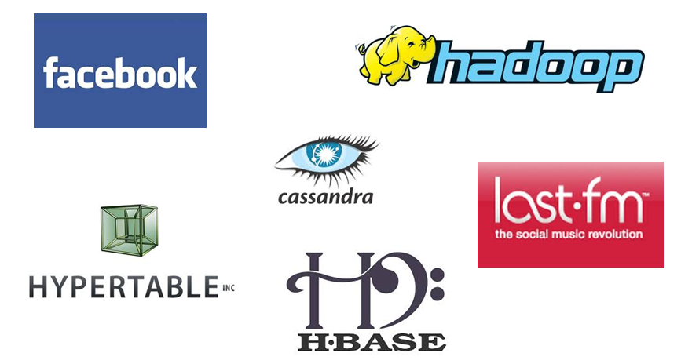

Introduction to Thrift
=======================================

.. figure:: images/Apache_Thrift_architecture.png
	:scale: 70%
	:alt: Apache Thrift Architecture.
	:align: right

	Thrift Architecture. 

	Image from wikipedia.org

Thrift is a lightweight, language-independent software stack with an
associated code generation mechanism for RPC. Thrift provides clean
abstractions for data transport, data serialization, and application
level processing. Thrift was originally developed by Facebook and now it is open sourced as an Apache project.
Apache Thrift is a set of code-generation tools that allows developers to build RPC clients and 
servers by just defining the data types and service interfaces in a simple definition file. Given 
this file as an input, code is generated to build RPC clients and servers that communicate 
seamlessly across programming languages. 

In this tutorial I will describe how Thrift works and 
provide a guide for build and installation steps, how to write thrift files and how to generate from 
those files the source code that can be used from different client libraries to communicate with 
the server. Thrift supports a variety of languages including C++, Java, Python, PHP, Ruby but
for simplicity I will focus this tutorial on examples that include Java and Python.

	Services using Thrift 

.. toctree::
   :maxdepth: 2
   
   

