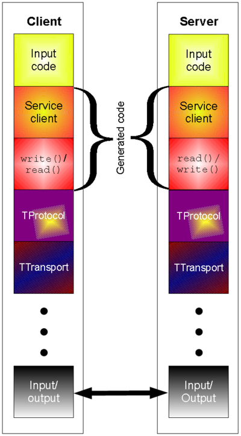

Thrift protocol stack
=======================================

To understand Thrift's protocol stack I highly recommend to take a look at the white-paper: http://thrift.apache.org/static/files/thrift-20070401.pdf and to the Thrift Architecture part of this very nice description here: http://jnb.ociweb.com/jnb/jnbJun2009.html - Part of the following content is directly derived from these sources.
I will now try to give a briefly present Thrift's architecture.

	Thrift Architecture. 

	Image from wikipedia.org

Runtime Library
----------------
The protocol and transport layer are part of the runtime library. This means that it is possible to define a service and change the protocol and transport without recompiling the code.

Protocol Layer
^^^^^^^^^^^^^^
The protocol layer provides serialization and deserialization.
Thrift supports the following protocols :

* TBinaryProtocol - A straight-forward binary format encoding numeric values as binary, rather than converting to text.
* TCompactProtocol - Very efficient, dense encoding of data (See details below).
* TDenseProtocol - Similar to TCompactProtocol but strips off the meta information from what is transmitted, and adds it back in at the receiver. TDenseProtocol is still experimental and not yet available in the Java implementation.
* TJSONProtocol - Uses JSON for encoding of data.
* TSimpleJSONProtocol - A write-only protocol using JSON. Suitable for parsing by scripting languages
* TDebugProtocol - Uses a human-readable text format to aid in debugging.
  

Tranport Layer
^^^^^^^^^^^^^^^
The transport layer is responsible for reading from and writing to the wire.
Thrift supports the following:

* TSocket - Uses blocking socket I/O for transport.
* TFramedTransport - Sends data in frames, where each frame is preceded by a length. This transport is required when using a non-blocking server.
* TFileTransport - This transport writes to a file. While this transport is not included with the Java implementation, it should be simple enough to implement.
* TMemoryTransport - Uses memory for I/O. The Java implementation uses a simple ByteArrayOutputStream internally.
* TZlibTransport - Performs compression using zlib. Used in conjunction with another transport. Not available in the Java implementation.

Processor
------------

The processor takes as arguments an input and an output protocol. Reads data from the input, processes the data throught the Handler specified by the user and then writes the data to the output.

Supported Servers
------------------
A server will be listening for connections to a port and will send the data it receives to the Processor to handle.

* TSimpleServer - A single-threaded server using std blocking io. Useful for testing.
* TThreadPoolServer - A multi-threaded server using std blocking io.
* TNonblockingServer - A multi-threaded server using non-blocking io (Java implementation uses NIO channels). TFramedTransport must be used with this server.

.. toctree::
   :maxdepth: 2
   
   

